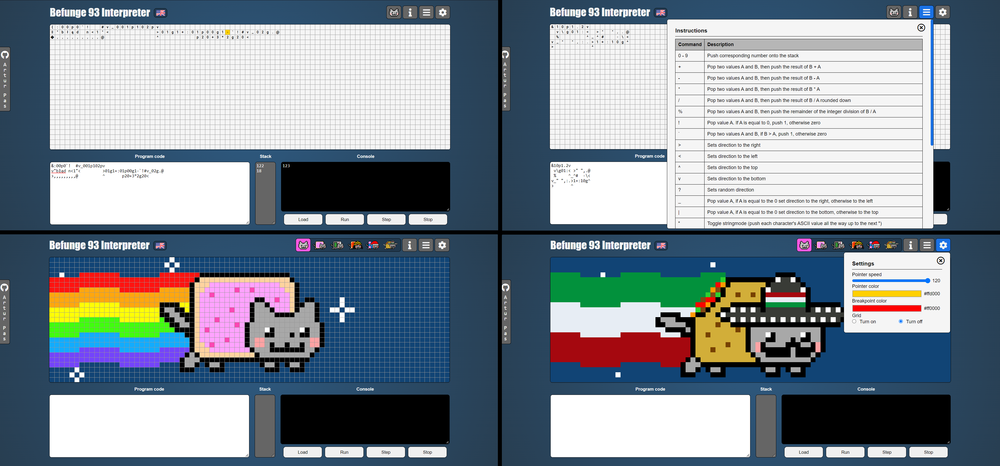

# BeFunge 93 Interpreter
Befunge 93 interpreter with visualization on grid, debugger and nyan cats pixel animations. 
See [live demo](https://pas-artur.000webhostapp.com/befunge93-interpreter/).

## Table of Contents
* [Technologies Used](#technologies-used)
* [Features](#features)
* [Setup](#setup)
* [Usage](#usage)
* [Project Status](#project-status)
* [Acknowledgements](#acknowledgements)

## Technologies Used
- HTML5
- LESS
- JS

## Features
- Interpretation of given code program
- Visualisation of program in grid, stack and interactive console
- Program controls (run, step, stop)
- Breakpoints that pause program execution
- Information about language and exapmle programs
- Tabel of availalble instructions
- Settings (speed, pointer and breakpoint color, grid lines visibility)
- Nyan cats animations (nyan cat, gameboy cat, rasta cat, christmas cat, mexican cat)
- Language change

## Setup
Copy repository and:
- Just open index.html in browser
- Start development server in VS Code using [LiveServer](https://marketplace.visualstudio.com/items?itemName=ritwickdey.LiveServer)
- Open project in [Prepros](https://prepros.io)

## Project Status
Project is: complete

## Acknowledgements
- This project was inspired by [qiao befunge93 interpreter](http://qiao.github.io/javascript-playground/visual-befunge93-interpreter/) 
- This project was based on [befunge 93 documentation](https://github.com/catseye/Befunge-93/blob/master/doc/Befunge-93.markdown)
